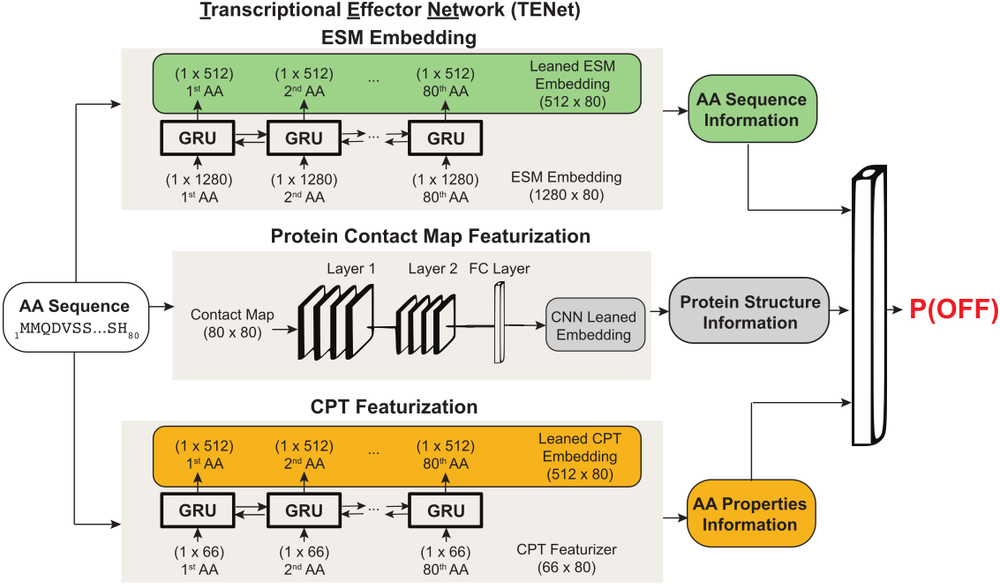

# Transcriptional Effector Network (TENet)
This repository contains code for the paper: [Prediction and design of transcriptional repressor domains with large-scale mutational scans and deep learning](TODO). 
By: Raeline Valbuena, AkshatKumar Nigam, Josh Tycko, Peter Suzuki, Kaitlyn Spees, Aradhana, Sophia Arana, Peter Du, Roshni A. Patel, Lacramiora Bintu, Anshul Kundaje, Michael C. Bassik

The primary goal of this repository is to provide users with the necessary tools to successfully train TENet using data from our screening experiments. Additionally, users can apply the trained model within an evolutionary algorithm (EA) framework to design novel transcriptional repressors.

- The list of initial domains, along with their sequences and classifications from our deep mutational scans, can be found [here](https://drive.google.com/file/d/1zDlblOi9r16k3Pmpf30UYcFnM4bms-2l/view?usp=sharing).
- The results of the HT-recruit screen are available [here](https://drive.google.com/file/d/1ZD2vPHar5mjUDK792QuBgWXZCJD8ZJpP/view?usp=sharing).
- Interactive UMAP visualizations of all domains, structured using different embeddings, can be downloaded from the following links:  
   (1) [Using ESM Embeddings (Figure 4D, left of the manuscript)](https://drive.google.com/file/d/1649fPY9hp3mmzuNY1jZ4zFtBlCS00z-z/view?usp=sharing)  
   (2) [Using TENet-based embeddings (Figure 4E, right of the manuscript)](https://drive.google.com/file/d/1lh0kG5H6HaKEq8KkF3otwzXwY2a2HEz5/view?usp=sharing)



## Prerequisites

Please ensure the following packages are installed prior to running any of the code provided within this repository:

- [Python 3.0 or higher](https://www.python.org/download/releases/3.0/) (this code was run on version 3.11.5)
- [PyTorch v2.2.0](https://pytorch.org/)
- [Numpy](https://pypi.org/project/numpy/)
- [Scipy](https://pypi.org/project/scipy/)
- [Matplotlib](https://matplotlib.org/stable/users/installing.html)
- [imbalanced-learn](https://pypi.org/project/imbalanced-learn/) 
- [ESM-2](https://github.com/facebookresearch/esm)
- [ESMFold](https://github.com/facebookresearch/esm)

To install these dependencies, run:

```bash
pip install torch numpy scipy matplotlib imbalanced-learn fair-esm 

# For installation of ESMFold
pip install "fair-esm[esmfold]"
# OpenFold and its remaining dependency
pip install 'dllogger @ git+https://github.com/NVIDIA/dllogger.git'
pip install 'openfold @ git+https://github.com/aqlaboratory/openfold.git@4b41059694619831a7db195b7e0988fc4ff3a307'
```

## File Navigator

- **create_data.py**: This script processes amino acid sequences, extracts features using ESM-2 embeddings, and computes contact maps and amino acid descriptors. The processed data is saved in chunks as pickle files in the `DATA/pickle_files` directory.
- **model.py**: Contains the architecture of the Transcriptional Effector Network (TENet), a deep learning model used for sequence processing and prediction tasks. It also includes code for training the model end-to-end on the provided data.
- **eval_model.py**: Loads the pre-trained TENet model and performs evaluation on the test data. This script computes predictions and evaluates the model’s performance by comparing predicted and actual values. Evaluation metrics, such as scatter plots and correlation values, are saved in the `PLOTS/` directory.
- **submit.sh**: A shell script for automating the training of TENet and subsequent evaluation of the trained model on a SLURM-based cluster. It calls `model.py` and `eval_model.py` for training and evaluation, respectively. Users must modify the `--account` flag to include their appropriate cluster account name before running `sbatch submit.sh`.
- **esmFold_bulk_structure_pred/**: A subdirectory for predicting protein structures in bulk using the ESMFold model.
  - **esmFold_bulk_pred.py**: A script designed to process large-scale protein sequence data in chunks using ESMFold for structure prediction. The results are saved as PDB files in the `pdb_files/` directory.
  - **submit_esmFoldBulk.sh**: A shell script to submit the `esmFold_bulk_pred.py` script to a SLURM-based cluster, enabling parallel processing of large datasets via job arrays. Adjust the `--account` flag and number of jobs as needed before running.
- **EA/**: A subdirectory implementing an Evolutionary Algorithm (EA) for protein sequence optimization.
  - **MAIN.py**: The main script that performs sequence optimization using an evolutionary approach. It generates mutant sequences, predicts their structures, and evaluates their fitness using a pre-trained model. The results, including PDB files and fitness scores, are saved in the `pdb_files/` and `OUTPUTS/` directories.
  - **submit.sh**: A shell script for submitting `MAIN.py` to a SLURM-based cluster, automating the evolutionary optimization process over multiple generations.
- **misc/**: A directory containing miscellaneous files, such as `TENet.png` (used for visualization in the documentation).
- **DATA/**: A directory where input data and processed outputs are stored. After running the scripts and training the model end-to-end, the following files and subdirectories are expected to exist:
  - `aa_descriptors.csv`: Contains amino acid descriptors utilized by the model.
  - `NEW_PARSE_4.csv`: Input CSV file containing amino acid sequences and experimental data.
  - `pdb_files/`: Directory containing PDB files used to calculate distance matrices for protein structures.
  - `pickle_files/`: Directory where processed data chunks are stored as `.pkl` files.


## Quick Start
This guide will walk you through the steps to prepare the data, train the TENet model, and apply the trained model within an Evolutionary Algorithm (EA) framework to optimize transcriptional repressors.

### 1. Preparing the Data

#### (a) Generate PDB Structures for Protein Sequences

If you are starting from scratch, the first step is to generate PDB structures using the **esmFold_bulk_structure_pred** scripts.

1. Navigate to the `esmFold_bulk_structure_pred/` directory.
2. Submit the job to generate PDB files in bulk:

```bash
cd esmFold_bulk_structure_pred
sbatch submit_esmFoldBulk.sh
```
This will predict structures for protein sequences in bulk using ESMFold, saving the results as PDB files in the pdb_files/ directory.

#### (b) Generate Inputs for the Neural Network
Once the PDB structures are generated, you can run create_data.py to extract features (such as ESM-2 embeddings, contact maps, and amino acid descriptors) and save them as pickle files for further model training.

```bash
python create_data.py
```
The processed data will be saved as chunks in the DATA/pickle_files/ directory.

Note: If you prefer to skip this step, you can download the pre-processed pickle files directly from [here](https://drive.google.com/drive/folders/1BzVvDauaOOaHIXXIMZNWkpg6OzvntLq1?usp=sharing) and place them in the `DATA/pickle_files/` directory.

### 2. Training the Model
Once the data is prepared, you can train the TENet model. The architecture of TENet is implemented in `model.py`. You can either run this script directly or submit it to a SLURM-based cluster using the provided submit.sh script (`sbatch submit.sh`).

### 3. Using a Trained Model in an Evolutionary Algorithm (EA)
Once the model is trained, you can use it within the Evolutionary Algorithm (EA) framework to design optimized transcriptional repressors. This EA is implemented in the EA/MAIN.py script.

1. Ensure the trained model is saved in the appropriate path (e.g., `model_no_attention.pt` in the `EA/` directory).
2. Submit the EA optimization job via SLURM:
    ```bash
    cd EA
    sbatch submit.sh
    ```
This process will run the evolutionary optimization, generating mutant sequences, predicting their structures, and evaluating their fitness using the trained model. The results, including PDB structures of mutant sequences and corresponding fitness scores, will be saved in the pdb_files/ and OUTPUTS/ directories.

## Questions, problems?
Make a github issue 😄. Please be as clear and descriptive as possible. Please feel free to reach
out in person: (akshat98[AT]stanford[DOT]edu)